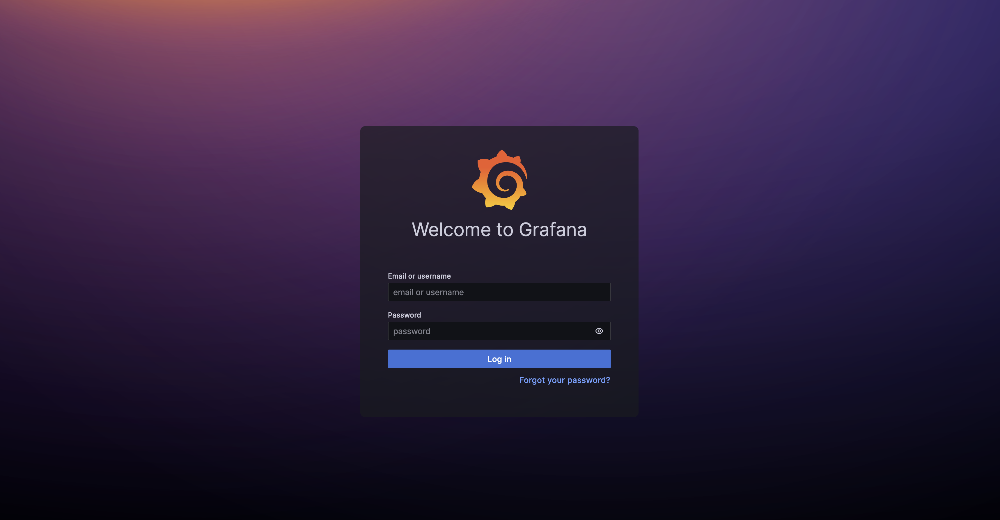

# Payload Aware Network Observability (PANO)

Welcome to the project site for Payload Aware Network Observability (PANO).

The goal of this project is to provide observability to networking levels 5, 6, and 7.  Typical 
observability tools only look at layers 3 and 4, outputing flow logs, which
summarize traffic flow by 5-tuple.  A great 
deal of information can be captured looking at higher level protocols,
such as DNS, HTTP, LDAP, SSL/TLS, SIP, etc.  As an 
example of PANO's utility, we present a demo using DNS.

While several approaches to this problem are possible, we sought to take a
balanced one, in terms of trading off efficiency vs. generality.
For example, while we could do everything in kernel space with eBPF, that
would require constant changes to the kernel.  Similarly, using python
for everything would be fast and simple, but slow due to the generality.
Instead, we strike a middle ground: we use eBPF in the kernel for packet filtering and capture, 
for performance reasons, and C++ or Go in user-space for efficient flexibility.
Where possible, where it makes sense, we re-use existing industry-standard tools.

## Background

As an observability tool, PANO consists of a pipeline of service components.  The pipeline 
captures raw packets, analyzes them, outputs metrics, and displays them on a dashboard.  A 
major difference with other tools is that it does not depend on the support of a
specific server (e.g., a specific DNS server such as [coredns](https://coredns.io/)).  It 
uses raw packets captured on the network to reconstruct the behavior of the server.

More detail can be found in a PPT deck [here](Pano-Web-Site.pptx).

## Pipeline Components

- RedHat's [NetObserv eBPF Agent](https://github.com/netobserv/netobserv-ebpf-agent) -- to capture relevant packets
- The [Zeek Network Security Monitoring Tool](https://zeek.org/) -- to analyze the relevant packets and emit the resulting logs
- Apache [Kafka](https://kafka.apache.org/) -- to communicate between components
- RedHat's [Flowlogs Pipeline](https://github.com/netobserv/flowlogs-pipeline) -- to convert logs to metrics
- CNCF's [Prometheus](https://prometheus.io/) -- to scrape metrics and centrally store them
- Grafana Labs [Grafana](https://grafana.com/) -- to visualize and display the metrics via a dashboard

## Changes We Made

Changes needed to the components consisted of the following:

- Code Changes:
    - [NetObserv eBPF Agent](https://github.com/netobserv/netobserv-ebpf-agent): Extensions to allow Full Packet Capture using eBPF, in addition to flow-logs.  The changes are currently in a [pull request](https://github.com/netobserv/netobserv-ebpf-agent/pull/113).  They are scheduled for inclusion in Netobserv 1.6.
- Package Additions:
    - An [Open-Soure Zeek Package](https://github.com/emnahum/zeek-pcapovertcp-plugin) that provides the [Zeek Network Security Monitoring Tool](https://zeek.org/) with [PCAP-over-TCP functionality](https://www.netresec.com/?page=Blog&month=2022-08&post=What-is-PCAP-over-IP).  Zeek itself requires no code changes. 
- Configuration (but no code changes):
    - [Flowlogs Pipeline](https://github.com/netobserv/flowlogs-pipeline) to handle DNS logs. Config file available [here](demo1/flowlogs-pipeline/pano-kafka-dns.yaml).
    - [Grafana](https://grafana.com/) to add a DNS dashboard. Dashboard available [here](demo1/grafana/pano-dns-dashboard.json). 
    - CNCF's [Prometheus](https://prometheus.io/) -- Minimal configuration.  Config file available [here](demo1/prometheus/prometheus.yml).
- No Changes at all:
    - Apache [Kafka](https://kafka.apache.org/) 

## Use Case: DNS

To illustrate PANO, we demonstrate a use case with DNS.  We configure the [NetObserv eBPF Agent](https://github.com/netobserv/netobserv-ebpf-agent) to capture all packets on UDP Port 53, the default DNS port.  

## Workload

In addition to our pipeline, we use two instances of a DNS load generation tool, DNS-OARC's [dnsperf](https://github.com/DNS-OARC/dnsperf).  One 
instance queries 8.8.8.8 (Google's DNS server) and another instance queries 9.0.0.1 (IBM's DNS server) simultaneously, using a sample DNS 
[querylist](demo1/dnsperf/dns-entry-list) from a trace taken at yorktown.ibm.com.

## Running the Demo

We have a demo of PANO's capabilities running in Docker. 

A recording of the demo is available [here](pano-demo.mp4).

### Requirements

You will need the following to run the demo:

- A Linux bare-metal machine or VM (we tested on `Ubuntu 22.04.3 LTS`).
- A relatively new Linux Kernel that supports CAP_BPF in Docker (tested on `5.15.0-78-generic`).
- Git - to check out the source tree (should be included in your Linux).
- Bash - to build the docker images from standard components (should be included in your Linux).
- Docker and docker-compose that support "host" networking (for Ubuntu get them [here](https://docs.docker.com/engine/install/ubuntu/) and 
[here](https://docs.docker.com/compose/install/linux/)).

### Check-out the Demo

Run 

```
git clone git@github.com:netobserv/pano-research.git
```

to check out the source tree.

### Building the Demo

Run `build-me.sh` in the demo1 subdirectory:

```
build-me.sh
```

You should see various component images downloading and some building.

### Running the Demo

Run `docker compose up -d` in the demo1 subdirectory:

```
docker compose up -d
```

You should see the various components come up:
```
Creating netobserv-ebpf-agent ... done
Creating zeek                 ... done
Creating kafka                ... done
Creating flowlogs-pipeline    ... done
Creating prometheus           ... done
Creating grafana              ... done
Creating dnsperf1             ... done
Creating dnsperf2             ... done
```

Now in a browser window, go to:

```
http://pano.sl.cloud9.ibm.com:3000/
```

(if you are running on a different machine, substitute `your-machine-name` for `pano.sl.cloud9.ibm.com`)

The first time you do this, you will see the following:



Grafana is asking you to log in.  The credentials are `admin` and `admin`.  If you change them, you must remember them for next time.
Our advice is to **not** change them and **skip** the password change.  

You may be presented with a `Dashboard` page.  If so, click the `Home` button in the upper left.

You should see a Welcome page:


In the lower left corner, click on the `PANO DNS Metrics`.

You should see something like the following:


At first, the page will not display anything, but in about 10-15 seconds it should start to populate.
