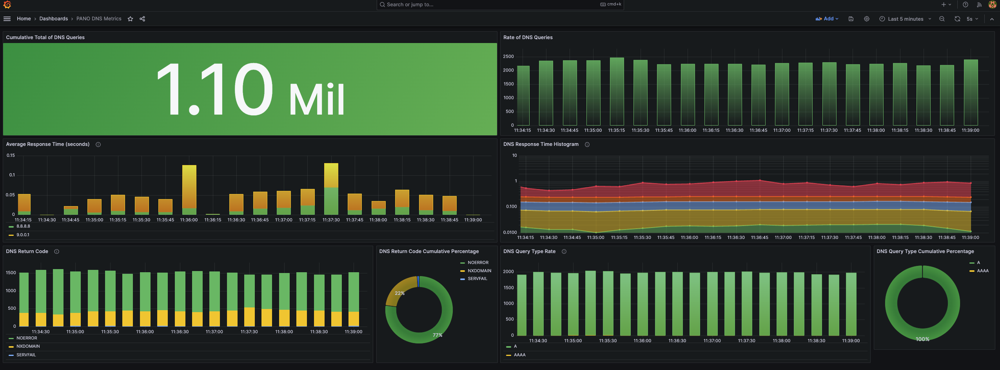

# Payload Aware Network Observability (PANO)

Welcome to the project site for Payload Aware Network Observability (PANO).

The goal of this project is to provide observability to networking levels 5, 6, and 7.  
Typical observability tools only look at layers 3 and 4, outputing flow logs, which
summarize traffic flow by 5-tuple..
A great deal of information can be captured looking at higher level protocols,
such as DNS, HTTP, LDAP, SSL/TLS, SIP, etc.
As an example of PANO's utility, we present a demo using DNS.

## Background

As an observability tool, PANO consists of a pipeline of service components.  
The pipeline captures raw packets, analyzes them, outputs metrics, and displays them on a dashboard.
A major difference with other tools is that it does not depend on the support of a
specific server (e.g., a specific DNS server such as [coredns](https://coredns.io/).  
It uses raw packets captured on the network to reconstruct the behavior of the server.

More detail can be found in a PPT deck [here](Pano-Web-Site.pptx)

## Pipeline Components

- RedHat's [NetObserv eBPF Agent](https://github.com/netobserv/netobserv-ebpf-agent)
- The [Zeek Network Security Monitoring Tool](https://zeek.org/)
- Apache [Kafka](https://kafka.apache.org/)
- RedHat's [Flowlogs Pipeline](https://github.com/netobserv/flowlogs-pipeline)
- CNCF's [Prometheus](https://prometheus.io/)
- Grafana Labs [Grafana](https://grafana.com/)

## Changes We Made

Changes needed to the components consisted of the following:

- Extentions to the [NetObserv eBPF Agent](https://github.com/netobserv/netobserv-ebpf-agent) to allow Full Packet Capture using eBPF, instead of flow-logs;
- An [Open-Soure Package](https://github.com/emnahum/zeek-pcapovertcp-plugin) that provides [PCAP-over-TCP functionality](https://www.netresec.com/?page=Blog&month=2022-08&post=What-is-PCAP-over-IP) to the [Zeek Network Security Monitoring Tool](https://zeek.org/)
- Configuration (but no code changes) to [Flowlogs Pipeline](https://github.com/netobserv/flowlogs-pipeline). Config file available [here](poc1/flowlogs-pipeline/pano-kafka-dns.yaml).
- Configuration (but no code changes) to [Grafana](https://grafana.com/) to add a DNS dashboard. Dashboard [here](poc1/grafana/pano-dns-dashboard.json). 

## Use Case: DNS

To illustrate PANO, we demonstrate a use case with DNS.  We configure the [NetObserv eBPF Agent](https://github.com/netobserv/netobserv-ebpf-agent) to capture all packets on UDP Port 53, the default DNS port.  

## Workload

In addition to our pipeline, we use two instances of a DNS load tool, DNS-OARC's [dnsperf](https://github.com/DNS-OARC/dnsperf), which queries 8.8.8.8 (Google) and 9.0.0.1 (IBM) simultaneously, using a sample DNS [querylist](poc1/dnsperf/dns-entry-list) from a trace taken at yorktown.ibm.com.

## Running the Demo

We have a demo of PANO's capabilities running in Docker. 

A recording of the demo will be made available soon.

### Requirements

You will need the following to run the demo:

- Linux (tested on `Ubuntu 22.04.3 LTS`).
- A relatively new Linux Kernel that supports CAP_BPF in Docker (tested on `5.15.0-78-generic`).
- Git - to check out the tree
- Bash - to build the docker images from standard components
- Docker and docker compose that support "host" networking

### Check-out the Demo

Run 

```
git clone git@github.com:netobserv/pano-research.git
```

to check out the source tree.

### Building the Demo

Run `build-me.sh` in the PoC1 subdirectory:

```
build-me.sh
```

You should see various component images downloading and some building.

### Running the Demo

Run `docker compose up -d` in the PoC1 subdirectory:

```
docker compose up -d
```

You should see the various components come up:
```
Creating netobserv-ebpf-agent ... done
Creating zeek                 ... done
Creating kafka                ... done
Creating flowlogs-pipeline    ... done
Creating prometheus           ... done
Creating grafana              ... done
Creating dnsperf1             ... done
Creating dnsperf2             ... done
```

Now in a browser window, go to:

```
http://pano.sl.cloud9.ibm.com:3000/
```

(if you are running on a different machine, substitute `your-machine-name` for `pano.sl.cloud9.ibm.com`)

The first time you do this, Grafana will ask you to log in.  The credentials are "admin" and "admin".  Don't change them, skip the password reset.

You should see a Welcome page:


In the lower left corner, click on the `PANO DNS Metrics`.

You should see something like the following:



(at first the page will not display anything, but in about 10-15 seconds it should start to populate)
